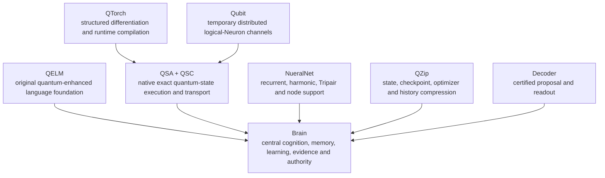

<div align="center">

# Brenton Carter

### Quantum Systems Architect · Quantitative Biologist · Founder, R&D BioTech Alaska

**Building exact quantum–classical systems for the hardware people already own.**

[](https://github.com/R-D-BioTech-Alaska/QSA)
[](https://github.com/R-D-BioTech-Alaska/Qelm)
[](https://github.com/R-D-BioTech-Alaska/Qubit)

[](https://www.rdbiotech.org)
[](https://orcid.org/0009-0007-8183-1111)
[](https://www.rdbiotech.org)

`quantum-state structure × classical control × reproducible evidence`

</div>

---

## About me

I am a quantitative biologist, researcher, and software architect working across **quantum information, artificial intelligence, computational physics, scientific software, distributed systems, and biology**.

My work is shaped by more than two decades of hands-on scientific and technical development, including over a decade building and operating **R&D BioTech Alaska**. I approach software the same way I approach laboratory research: define the mechanism, isolate variables, preserve controls, record negative results, and only make claims that the evidence supports.

Much of my current work asks a practical physics and computing question:

> **Can quantum-state structure become a useful computational resource on ordinary computers, without requiring every calculation to be flattened into a global statevector or sent to a physical quantum processor?**

The connected answer I am building includes **QELM, Brain, Qubit State Algebra (QSA), Tripair, NueralNet, QTorch, QZip, Qubit, and Decoder**.

At the center of that work is **Brain**.

QELM began as the language and quantum-learning foundation. Brain grew from QELM when the project expanded beyond next-token generation into a governed cognitive architecture with memory, continuing learning, truth handling, consolidation, internal support systems, reversible model evolution, and distributed temporary computation.

QSA was created because Brain needed a quantum-state engine built for that larger purpose.

Physical quantum hardware can participate as an additional backend, but it is not a prerequisite for the architecture. Quantum-state mathematics supplies structure, phase, interference, entanglement relationships, observables, and state evolution. Classical systems supply memory, control, optimization, persistence, training, and large-scale execution.

The goal is not to replace one with the other.

The goal is to make both sides stronger by allowing them to exchange work.

---

## Brain

> **QELM gave Brain its language foundation, and Brain created the need for QSA.**

Brain is one of my most important long-term projects and one of the main reasons the rest of the quantum–classical stack exists.

QELM began by exploring how quantum channels, phase, amplitude, sub-bit states, trainable circuits, and hybrid backends could participate directly in language processing. As that work matured, the larger problem became clear: language generation alone was not enough.

A persistent intelligent system also has to manage memory, learning, evidence, internal state, model changes, safety, distributed resources, and the difference between an experiment and an accepted improvement.

That larger system became **Brain**.

### What Brain is

Brain is a locally controlled quantum–classical cognitive architecture built around a capable language foundation, persistent memory, continual learning, internal support systems, and clear control over what is allowed to change.

Its purpose is to bring together:

- language generation and reasoning;
- working, episodic, semantic, and procedural memory;
- salience and prioritization;
- online learning and offline consolidation;
- evidence-aware truth handling;
- canonical behavior and identity preservation;
- reversible model improvement;
- quantum-state computation through QSA;
- recurrent, harmonic, and Tripair support through NueralNet;
- exact preservation of states and learning history through QZip;
- temporary distributed logical-Neuron resources through Qubit;
- proposal verification and readout through Decoder.

Brain is not meant to be a conventional language model with a collection of loosely connected tools around it.

It is a coordinated system where language, memory, learning, quantum-state processing, safety, and action have different responsibilities. The language model is still important, but it is one part of Brain rather than the definition of Brain.

### How I am building Brain

Most AI systems treat each interaction as a new prompt to a mostly fixed model. Brain is being built around a different cycle:

```text
Immediate interaction
        ↓
Working state and memory retrieval
        ↓
Language, reasoning, and quantum–classical support
        ↓
Evidence and safety checks
        ↓
Response or action
        ↓
Bounded learning
        ↓
Offline consolidation and evaluation
        ↓
Adopt, reject, or roll back
```

The accepted model is protected while new ideas are tested.

New mechanisms are attached at exact no-op whenever possible, compared against the frozen parent and matched conventional controls, and only adopted when they demonstrate a real benefit without damaging retained capabilities. Failed or neutral experiments remain evidence rather than being hidden.

The point is simple:

> **Having an idea is not the same as proving that it improved the system.**

### Why Brain required QSA

Early QELM experiments could use NumPy, Qiskit, Aer, and conventional statevector methods. Brain required a quantum-state foundation designed around its own needs.

Brain needed:

- exact quantum-state execution on ordinary CPUs and GPUs;
- direct control over the state representation and numerical core;
- compact handling of separable and structured states;
- dynamic merging only when interactions require it;
- exact recovery of separability after measurement or evolution;
- persistent and checksummed quantum-state storage;
- bounded temporary state for distributed nodes;
- predictable reset and destruction of native resources;
- a state engine that could later be differentiated, compiled, compressed, transported, and integrated into learning.

That requirement became **Qubit State Algebra**.

QSA was not built as an unrelated simulator and attached later. It was created because Brain needed a native way to use quantum-state structure in cognition, memory, learning, and distributed computation without depending on a physical quantum processor.

The lineage is:

```text
QELM
  ↓
quantum-enhanced language, channels, phase, sub-bit states, training
  ↓
Brain
  ↓
persistent cognition, memory, learning, evidence, safety and authority
  ↓
QSA
  ↓
native exact quantum-state execution for Brain and the surrounding stack
```

### What Brain has already shown

Without giving away private implementation details, Brain has already produced several measurable results:

- **A controlled QSA benefit:** a native-QSA support path reached `89.23%` capability quality versus `88.46%` for both the frozen parent and an equal-parameter conventional control on development and sealed holdout evaluation.
- **Improved instruction behavior:** the same QSA candidate improved holdout instruction compliance from `80.77%` to `84.62%` and reduced maximum-token termination from `3.85%` to `1.54%`.
- **Large same-budget language gains:** a later language phase reduced broad cross-entropy by `16.52%`, reduced perplexity by `36.43%`, and produced `314,442` additional correct development tokens without increasing the total parameter budget.
- **Exact-safe subsystem attachment:** the NueralNet support fabric was attached at exact zero while preserving broad, canonical, safety, and next-token outputs tensor-exactly.
- **Causal evaluation:** support systems can be disabled, reset, or rolled back to determine whether a measured gain came from the proposed mechanism rather than from hidden parameter growth or parent-model drift.

Not every result above is quantum-attributable. Results are labeled according to the mechanism that was actually active. That separation is intentional and central to the project.

### Current direction

The current direction is to make Brain more self-contained while keeping measurable control over every major subsystem.

The goal is a system that can:

- interact immediately;
- learn continuously without rewriting itself recklessly;
- consolidate knowledge and experience offline;
- preserve provenance and model lineage;
- use quantum-state structure where it provides a real advantage;
- recruit temporary distributed resources without surrendering privacy or authority;
- compare new mechanisms against fair classical controls;
- remain recoverable when an experiment fails;
- operate locally on practical hardware.

Brain is what connects these projects.

QELM supplies the original language and quantum-learning foundation. QSA supplies native quantum-state execution. NueralNet supplies bounded internal coordination. QTorch develops the training path. QZip preserves exact state and history. Qubit expands temporary working capacity. Decoder verifies proposals.

**Brain is the system that brings them together and controls how they are used.**

---

## The physics behind QSA

QSA begins with the structure that the quantum state actually has.

For a register partitioned into independent components \(P\),

\[
|\Psi\rangle = \bigotimes_{C \in P} |\psi_C\rangle
\]

The partition is part of the runtime state:

- independent qubits remain independent;
- interacting components merge only when an operation connects them;
- each component independently uses the exact representation best suited to its current structure;
- measurement and factor recovery can separate components again;
- a global \(2^n\) statevector is materialized only when the realized state actually requires it.

A pure single-qubit state retains both amplitude and phase:

\[
|\psi\rangle =
\cos\left(\frac{\theta}{2}\right)|0\rangle +
e^{i\phi}\sin\left(\frac{\theta}{2}\right)|1\rangle
\]

This matters to QELM because \(\theta\), \(\phi\), interference, correlations, and structured observables can become computational features rather than being immediately reduced to one measured scalar.

---

## Public research projects

<table>
<tr>
<td width="33%" valign="top">

### [QSA](https://github.com/R-D-BioTech-Alaska/QSA)

**Qubit State Algebra**

A from-scratch C++20 runtime for exact, structure-aware quantum-state execution on ordinary hardware.

- Dynamic component partitioning
- Bloch-cell singletons
- Sparse and dense local patches
- Exact separability recovery
- Symmetry and Grover states
- Stabilizer tableaus
- Phase-graph states
- Quantum-dot pockets
- QSC state persistence

</td>
<td width="33%" valign="top">

### [QELM](https://github.com/R-D-BioTech-Alaska/Qelm)

**Quantum-Enhanced Language Model**

A language-model framework built around trainable quantum circuits, quantum channels, sub-bit encoding, amplitude and phase features, next-token learning, memory, and multiple execution backends.

QELM is not intended to be a conventional language model with a decorative quantum layer attached.

</td>
<td width="33%" valign="top">

### [Qubit](https://github.com/R-D-BioTech-Alaska/Qubit)

**Distributed Quantum Channels**

A privacy-preserving node architecture in which ordinary devices contribute temporary logical quantum channels to QELM.

Nodes perform bounded work, return results, and release their temporary state without retaining user history, permanent model memory, or independent authority.

</td>
</tr>
</table>

---

## The wider Brain research stack



Brain is the center of the architecture. It inherits QELM's language and quantum-learning direction while adding persistent cognition, memory, truth handling, consolidation, safety, action governance, model adoption, and rollback authority.

The surrounding systems remain subordinate to Brain's accepted state:

- **QSA** executes and transports exact quantum states.
- **NueralNet** supplies bounded recurrent, harmonic, Tripair, and logical-Neuron support.
- **QTorch** develops structured training and differentiation paths.
- **QZip** preserves exact state and learning history efficiently.
- **Qubit** provides temporary distributed quantum channels without permanent model authority.
- **Decoder** proposes and verifies output without becoming the model itself.

### Active repositories

| Repository | Role | Availability |
|---|---|---|
| [QSA](https://github.com/R-D-BioTech-Alaska/QSA) | Exact structured quantum-state execution and QSC persistence | **Public** |
| [QELM](https://github.com/R-D-BioTech-Alaska/Qelm) | Quantum-enhanced language architecture and original research platform | **Public** |
| [Qubit](https://github.com/R-D-BioTech-Alaska/Qubit) | Distributed temporary quantum-channel nodes | **Public** |
| [BrainQ](https://github.com/R-D-BioTech-Alaska/BrainQ) | Central Brain integration, controlled learning, memory, evidence, safety, evaluation, model adoption, and rollback | **Private for now** |
| [NueralNet](https://github.com/R-D-BioTech-Alaska/NueralNet) | Harmonic/string recurrence, Tripair pathways, remote logical-Neurons, and support learning | **Private for now** |
| [QTorch](https://github.com/R-D-BioTech-Alaska/QTorch) | Structure-aware differentiation, compilation, and PyTorch interoperability | **Private for now** |
| [QZip](https://github.com/R-D-BioTech-Alaska/QZip) | Exact compression of states, tensors, checkpoints, optimizer histories, and Brain archives | **Private for now** |
| [Decoder](https://github.com/R-D-BioTech-Alaska/Decoder) | Certified speculative decoding and proposal verification without execution authority | **Private for now** |

The private repositories are active parts of the architecture and will be made public when their source, tests, documentation, and release boundaries are ready.

---

## Tripair

**Tripair** is my three-state quantum coordination and reward concept for Brain/QELM.

It is intended to coordinate bounded relationships among learning signals, cognitive systems, temporary quantum resources, and governed state transitions. The term is specific to this architecture and should not be replaced with generic three-body or tripartite terminology except when explicitly comparing it with established entanglement classes.

---

## Selected measured results

### Exact quantum-state execution

| Result | Measurement |
|---|---:|
| Independent differential validation | **14,400 randomized gate operations passed** |
| Fidelity tolerance | \(\left|1-F\right| \le 2 \times 10^{-10}\) |
| Independent product register | **10,000 qubits in 1.03 MiB** |
| Exact GHZ state | **50 qubits in 5.60 KiB** |
| Independent Bell pairs | **100 pairs in 25.88 KiB** |
| Compressed 16-qubit Grover path | **209,123× measured speedup** over the original dense QSA-era path |
| Compressed Grover memory | **10,922× measured reduction** at 16 qubits |
| Count-only Grover state | **60 logical qubits, 843,314,856 iterations, 88 bytes** |

These are exact, structure-dependent measurements. They do **not** remove the exponential worst case for arbitrary highly entangled states.

### Quantum-state support inside AI

A controlled QSA capability experiment used:

- an immutable trained parent;
- exact no-op attachment;
- the same input channels and residual geometry for both trainable arms;
- **10,945 trainable parameters per arm**;
- a parameter-matched conventional control;
- full autoregressive checkpoint selection;
- sealed holdout evaluation;
- protected-parent and native-resource checks.

| Evaluation | Frozen parent | Conventional control | Hybrid QSA |
|---|---:|---:|---:|
| Development quality | 88.46% | 88.46% | **89.23%** |
| Sealed holdout quality | 88.46% | 88.46% | **89.23%** |
| Holdout instruction compliance | 80.77% | 80.77% | **84.62%** |
| Holdout max-token termination | 3.85% | 3.85% | **1.54%** |
| Holdout language cross-entropy | 4.50917 | 4.50917 | **4.50836** |

The hybrid corrected four records and regressed two on each split, for a net gain of two. This is a **bounded, reproducible capability result**. It is not a claim that every quantum mechanism improves every AI task.

### QELM language development

A later QELM language phase completed a 24,576-step sealed training run with:

- **16.52% lower broad cross-entropy**
- **36.43% lower perplexity**
- **+7.4969 percentage points exact-token match**
- **314,442 additional correct development tokens**
- improved canonical behavior and structured safety
- zero nonfinite events
- zero QMarker collisions

Native QSA and Tripair were disabled in that phase, so these figures demonstrate QELM training and architecture progress rather than quantum attribution.

---

## What I am trying to prove

Brain is where the main research questions come together. I am not interested in adding the word *quantum* to an existing system just to call it quantum. I am trying to determine whether quantum-state structure can actually improve how a cognitive system learns, remembers, reasons, coordinates its internal processes, and scales on ordinary hardware.

Some of the questions I am testing are:

- Which state structures can remain exact without global materialization?
- When does gate semantics prove that a component merge is unnecessary?
- Can separability be recovered after interaction or measurement?
- Can exact structured-state engines outperform equal-capacity conventional mechanisms inside AI?
- Can amplitude and phase carry useful learned information independently?
- Can quantum and classical representations exchange work without either side being treated as secondary?
- Can a model gain new capabilities while its accepted parent remains immutable and exactly recoverable?
- Can distributed devices contribute temporary quantum-state work without receiving private memory or persistent identity?
- Can scientific AI remain measurable, reversible, and locally controlled while continuing to learn?

---

## Engineering and validation principles

- **Exact and approximate paths are labeled separately.**
- **Structured-state gains are not generalized to arbitrary states.**
- **Physical QPUs are optional backends, not the definition of quantum execution.**
- **New AI mechanisms begin at exact no-op whenever possible.**
- **Controls match active trainable capacity, not merely nominal parameter count.**
- **Sealed holdouts remain closed until advancement conditions are met.**
- **Infrastructure success is reported separately from capability improvement.**
- **Accepted checkpoints remain checksum-bound, recoverable, and protected.**
- **Native resources are reset and destroyed after bounded work.**
- **Negative, neutral, and failed results remain part of the record.**
- **A working system matters more than a fashionable abstraction.**

---

## For developers and physicists

The areas most open to serious technical discussion and future collaboration include:

- exact state-component factorization;
- alternative separability and rank-recovery methods;
- sparse/dense transition policies;
- tensor-network and decision-diagram interoperability;
- stabilizer, phase-graph, and symmetry routing;
- quantum-dot Hamiltonians and local-system models;
- differentiable quantum-state execution;
- parameter-shift, adjoint, SPSA, and hybrid gradient systems;
- quantum-aware checkpoint and optimizer-history compression;
- reproducible AI ablations and matched controls;
- distributed state execution with strict privacy boundaries;
- GPU kernels, CUDA backends, SIMD, and multicore scheduling;
- formal verification of state transformations and serialized QSC data.

I value people who are willing to challenge assumptions, reproduce the benchmarks, read the actual implementation, and separate an interesting result from an unsupported claim.

---

## Research publications

### Qubit State Algebra

**Qubit State Algebra: An Adaptive Component-Based Representation for Exact Pure-State Quantum Simulation on Classical Hardware**

[](https://doi.org/10.13140/RG.2.2.19653.20965)

### QELM

**Quantum-Enhanced Language Model**

[](https://doi.org/10.13140/RG.2.2.11844.90243)

---

## Technical environment


---

## Beyond quantum computing

My broader work includes:

- quantitative and computational biology;
- biochemical and treatment simulation;
- cancer-modeling software;
- scientific data systems;
- greenhouse and environmental systems;
- embedded devices and sensor integration;
- privacy-preserving local applications;
- distributed computing;
- model compression and versioned scientific archives;
- tools designed to put advanced technical systems into the hands of ordinary users.

---

## Connect

- **Research organization:** [R&D BioTech Alaska](https://www.rdbiotech.org)
- **QELM:** [Qelm.org](https://www.qelm.org)
- **ORCID:** [0009-0007-8183-1111](https://orcid.org/0009-0007-8183-1111)
- **LinkedIn:** [linkedin.com/in/inserian](https://www.linkedin.com/in/inserian)
- **X:** [@Inserian](https://x.com/Inserian)
- **GitHub:** [@Inserian](https://github.com/Inserian)

---
